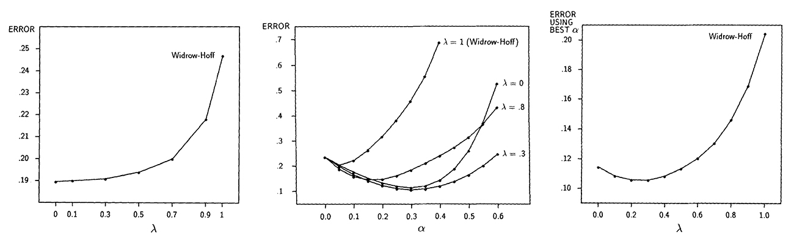
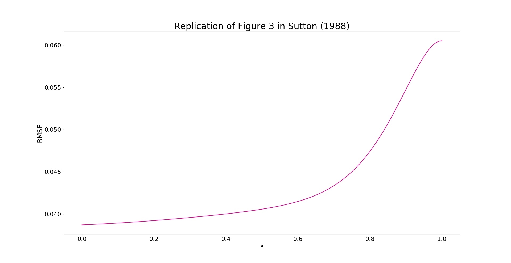
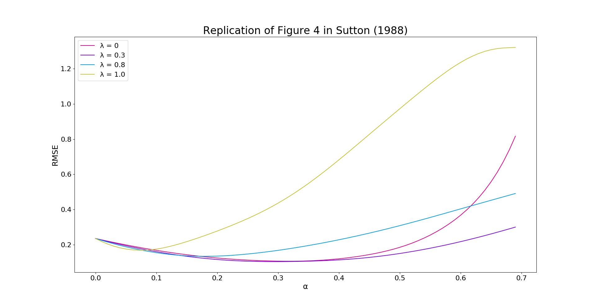
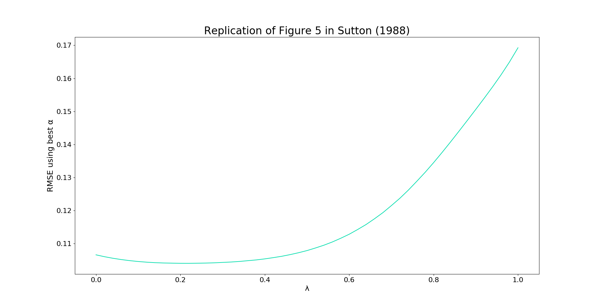

# CS 7642 
### TD(λ) Learning and Random Walks
Reproducing Sutton's 1988 Results
In this project, we are going to replicate the output within the paper of Richard Sutton's 1988. Knowing that in the Richard Sutton's 1998 paper, the acts performed by Suttons were as per the oral agreement between both the parties and as Warners asserted that there was an oral agreement between the two, it provides sufficient evidence in the court to take off this oral contract from the ‘Statute of Fraud’. Hence below are the illustration of graphs indicating the result of replication made:
 
 
 
Hence below are the illustration of graphs indicating the result of replication made:

 
### Coding

In the system libraries, first we have installed both the Matplotlib and the NumPy and do the activation.To insatll the matplotlib, we have used the command "pip install matplotlib". Knowing that this is very importnat in order to create the graphs/plots for this project 
Next step is open the td_learning.py and then perform right steps in order to run the code to the experiments. The results are attached in this project with the code which is the graphs with the calculations of plots. To run the code, after we have set up the numpy and matplotlib, we have strated to perform and cleaning the code, from the indent and all applied data that been needed in the experiment based on the instruction. After that, we open the IDLE Shell of Python 3, clikcing on the new file, and saved it to the project, then run the code through module. 

